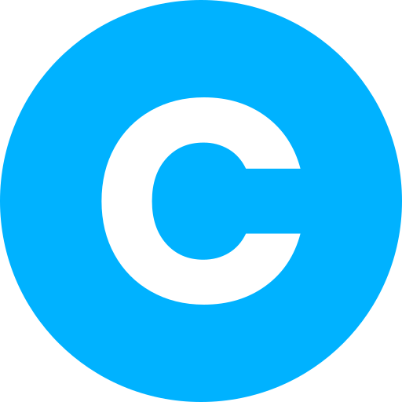

# Coursera & DeepLearning Subtitle Translator Pro 🚀

<div align="center">
  
  <p><strong>Tiện ích mở rộng Chrome dịch phụ đề song ngữ chuẩn xác, mượt mà trên Coursera và Deeplearning.ai</strong></p>
</div>

---

## 🌟 Các nâng cấp đột phá ở phiên bản Pro

Phiên bản cũ thường gặp tình trạng **"lúc dịch được lúc không ăn"**, câu dịch bị cắt vụn hoặc lệch phụ đề do:
- Google Translate API bị chặn bot với `client=gtx` và lỗi giới hạn độ dài URL (HTTP 413).
- Cắt câu theo dấu chấm đơn lẻ làm lệch thứ tự câu (`z~~~z` bị xáo trộn).
- Không tự phát hiện được khi chuyển bài học mới (SPA Navigation) trên Coursera.
- Bị ghi đè phụ đề gốc làm mất tiếng Anh.

### ✨ Các cải tiến mới:
1. **Dịch theo câu hoàn chỉnh (Semantic Sentence Grouping)**:
   - Tự động ghép các đoạn ngắt giọng nhỏ thành câu tự nhiên đầy đủ ngữ pháp trước khi dịch.
   - Bản dịch Google Translate đạt **độ chính xác cao hơn rõ rệt**, không còn dịch cụt lủn hay sai ngữ cảnh kỹ thuật.
2. **Cơ chế Batch Translation & Giữ nguyên chỉ mục câu**:
   - Sử dụng endpoint Google Translate chuẩn dành cho extension (`client=dict-chrome-ex`) qua POST request.
   - Chia theo batch 20 câu/lần kèm đánh dấu index `[0]`, `[1]`,... đảm bảo **100% khớp đúng timeline**, không bao giờ bị lệch phụ đề.
3. **Hiển thị Song ngữ (Bilingual) cao cấp**:
   - Dòng 1: Tiếng Anh gốc (giúp học từ vựng chuyên ngành).
   - Dòng 2: Tiếng Việt (hoặc ngôn ngữ bạn chọn).
   - Thiết kế dạng capsule hiện đại với hiệu ứng làm mờ nền (backdrop blur), rõ nét và êm mắt.
   - Hỗ trợ 3 chế độ: **Song ngữ**, **Chỉ bản dịch**, hoặc **Chỉ tiếng Anh**.
4. **Đồng bộ thời gian thực siêu mượt (Zero-lag Sync)**:
   - Sử dụng `requestAnimationFrame` kết hợp thuật toán tìm kiếm O(1) theo thời gian video, phụ đề chuyển mượt mà không bị trễ hay giật.
5. **Tự động bắt video khi chuyển bài học (SPA Watcher)**:
   - Theo dõi sự thay đổi URL và video player khi bấm chuyển bài trong Coursera & Deeplearning.ai, tự động tải và dịch bài mới.
6. **Hỗ trợ Fullscreen hoàn hảo**:
   - Tự động neo giao diện phụ đề vào chế độ toàn màn hình, không bị biến mất khi phóng to video.
7. **Nút điều khiển nổi (Floating Button)**:
   - Nút 🌐 nhỏ gọn ngay trên góc video: hiển thị tiến độ dịch và cho phép bấm Bật/Tắt tức thì mà không cần mở popup.

---

## 🚀 Cài đặt vào Chrome / Cốc Cốc / Edge / Brave

1. **Tải source code về máy**:
   ```bash
   git clone https://github.com/DauDinhQuangAnh/Coursera-DeepLearning-Subtitle-Translator-Pro.git
   ```
2. **Mở trang quản lý Extensions**:
   - Truy cập: `chrome://extensions/` (hoặc `edge://extensions/`)
   - Bật công tắc **Developer mode** (Chế độ dành cho nhà phát triển) ở góc phải trên.
3. **Cài đặt tiện ích**:
   - Nhấn nút **Load unpacked** (Tải tiện ích đã giải nén).
   - Chọn thư mục `coursera-translator`.
4. **Tải lại tab Coursera hoặc Deeplearning.ai** đang mở để extension bắt đầu hoạt động!

---

## 📖 Hướng dẫn sử dụng

1. Mở bài giảng video trên **Coursera** hoặc **Deeplearning.ai**.
2. **Bật dịch**:
   - Nhấp vào nút **🌐** nổi ở góc trên video player để Bật/Tắt dịch nhanh.
   - Hoặc nhấp vào icon tiện ích trên thanh công cụ trình duyệt để mở bảng điều khiển.
3. **Tùy chỉnh trong Popup**:
   - **Ngôn ngữ đích**: Tiếng Việt, Tiếng Trung, Tiếng Nhật, Tiếng Hàn, Tiếng Tây Ban Nha,...
   - **Kiểu hiển thị**: Song ngữ (khuyên dùng), Chỉ bản dịch, Chỉ tiếng Anh.
   - **Cỡ chữ**: Nhỏ (15px), Vừa (18px), Lớn (22px).
   - **Tự động dịch**: Bật để extension tự tải phụ đề mỗi khi bạn mở video mới.

---

## 🛠️ Công nghệ

- Chrome Extension Manifest V3
- Pure Modern JavaScript (ES6+ async/await)
- Google Translate API Engine (Batch Chunking & Index Preservation)
- Responsive CSS3 Backdrop-filter UI Overlay

---

## 💖 Lời cảm ơn & Nguồn tham khảo (Credits & Acknowledgments)

Dự án này được kế thừa và phát triển nâng cấp mở rộng dựa trên ý tưởng và mã nguồn ban đầu của tác giả [bombap](https://github.com/bombap):
- Repository gốc: [bombap/coursera-translator](https://github.com/bombap/coursera-translator)
- Xin chân thành cảm ơn tác giả **bombap** vì đã chia sẻ mã nguồn nền tảng giúp cộng đồng có cơ hội tiếp tục hoàn thiện và phát triển các tính năng hữu ích này!

---

## 📝 Giấy phép

Dự án phát hành theo giấy phép MIT.
